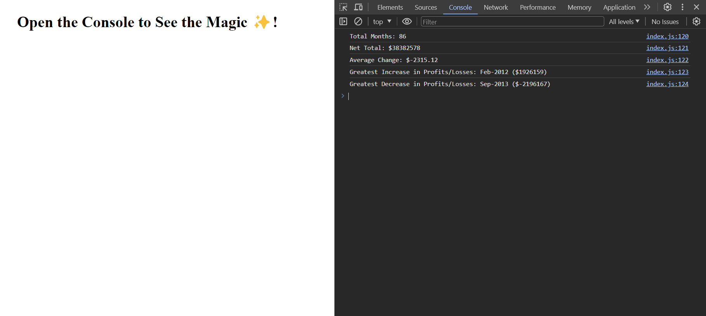

# Console Finances

A JavaScript program that calculates the finaces of a given Array and dsiplays it's data in the Console.

[**Deployed Project**](https://sebzg.github.io/Console-Finances/)

## Usage
To view displayed data, open Dev Tools and open the Console tab.

## Resources
- [**MDN Web Docs**](https://developer.mozilla.org/) 
- [**W3 School**](https://www.w3schools.com/)

 ##

